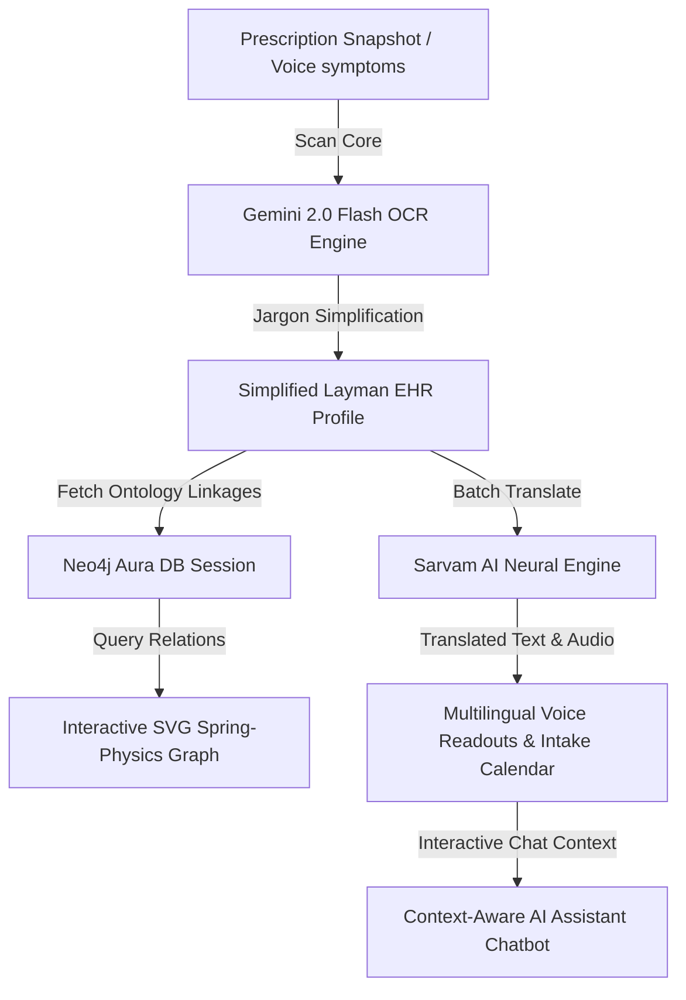

# 🧬 SymptoGraph AI
> **Next-Generation Medical Interpreter, Multilingual Voice Assistant & Health Ontology Graph**
> Built for Hack Hazards '26 | Team Nexus Assassins 🛡️

---

## 🌌 Overview
**SymptoGraph AI** is a futuristic medical command center designed to demystify complex clinical data for patients. By combining **Gemini 2.0 AI vision OCR**, **Sarvam AI multilingual speech interfaces**, and **Neo4j Aura Graph Databases**, SymptoGraph scans doctor prescriptions, translates medical jargon into plain terms, reads schedules aloud in local Indian dialects, and visualizes biological relations on an interactive spring-physics SVG network graph.

---

## ⚡ Architecture Flow



---

## 🛠️ System Stack Matrix

| Module | Technology | Purpose |
| :--- | :--- | :--- |
| **Cognitive OCR & Vision** | `Gemini 2.0 Flash` | High-fidelity vision parsing of doctor scribbles & lab tables |
| **Neural Translations** | `Sarvam AI Translate` | Delimiter-aligned batch neural translation (10 Indian languages) |
| **Speech-To-Text (STT)** | `Sarvam Saarika v2.5` | Native regional voice dictation & speech inputs |
| **Text-To-Speech (TTS)** | `Sarvam Bulbul v2` | Audio readout of dosage timetables and warning alerts |
| **Graph Database** | `Neo4j Aura Cloud DB` | Dynamic storage & retrieval of health ontologies |
| **Graph Layout** | `SVG Spring Force Engine` | Interactive coordinate positioning with grab & drag physics |
| **Core Web App** | `Next.js 16 (Turbopack)` | Serverless edge functions & responsive layout |
| **Design Language** | `Teal/Cyan Glassmorphism` | High-tech medical cockpit themes with glowing indicators |

---

## 📡 Key Features

### 🔬 Holographic Laser Scanner
Drag-and-drop reports or activate your webcam to scan documents inside a glowing, laser-animated camera capture frame.

### 🕸️ Spring-Physics Health Ontology Network
An interactive SVG node network mapping the patient's condition to relevant **Organ Systems**, **Medications**, **Symptoms**, and **Habits**. Grab and drag nodes to interact with connection spring calculations.

### 🔊 Multilingual voice readouts
Listen to simplified prescription guidelines spoken in Hindi, Tamil, Telugu, Marathi, or Gujarati. Gracefully falls back to browser voice engines if the API is offline.

### 📅 Gamified Intake Calendar
Check-in daily dosage slots (Morning, Afternoon, Night) to earn "Wellness Points (XP)" stored locally. Triggers custom synthesized chimes via the browser Web Audio API on click.

### 💬 Context-Aware Clinical AI Assistant
A floating chat drawer in the bottom right that inherits the active patient scan data, allowing conversational questions about diets, drug purposes, or warning symptoms.

---

## 🚀 Deployment & Installation

### 1. Clone & Setup Environments
Initialize the project folder and configure `.env.local`:
```bash
git clone https://github.com/rtx-exe-666/symptograph-ai.git
cd symptograph-ai
```

Create a `.env.local` file in the root directory:
```env
GEMINI_API_KEY=your_gemini_api_key
NEO4J_URI=neo4j+s://your-instance.databases.neo4j.io
NEO4J_USERNAME=neo4j
NEO4J_PASSWORD=your_instance_password
SARVAM_API_KEY=your_sarvam_api_key
```

### 2. Install Dependencies
```bash
npm install
```

### 3. Seed the Graph Database
Run the pre-configured CommonJS adapter script to clean and write the initial **28 medical ontology nodes** and relations:
```bash
node scratch_seed_cjs.js
```

### 4. Run Development Workspace
```bash
npm run dev
```
Open [http://localhost:3000](http://localhost:3000) on your local browser.

---

## 💎 Team Nexus Assassins Hackathon Credentials
- **Lead Developer**: Kuldeep Singh
- **Target Event**: HACKHAZARDS 2026
- **License**: MIT Concept License
